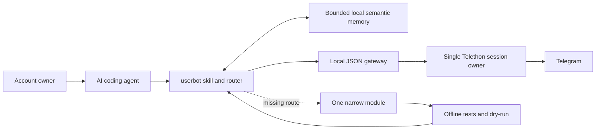

# Telegram Userbot Skill

<p align="center">
  <a href="README.md"><strong>English</strong></a> ·
  <a href="README.ru.md">Русский</a>
</p>

<p align="center">
  
</p>

<p align="center">
  <strong>Give an AI coding agent a guarded, auditable, and extensible interface to your own Telegram account.</strong>
  <br>
  Telegram channel: <a href="https://t.me/house_404"><strong>@house_404</strong></a>
</p>

This repository packages an agent-neutral skill named **`userbot`** and a secret-free [Telethon](https://docs.telethon.dev/) runtime template. It lets a coding agent inspect Telegram, work with messages and media, manage supported account features, receive events, reuse compact locally stored knowledge, and extend the local runtime with one narrowly scoped operation when the existing catalog does not cover a request.

It is a user-account automation toolkit, not a Bot API wrapper. It operates through a Telegram session authorized by the account owner.

> [!CAUTION]
> **This skill can take full operational control of your Telegram account.**
>
> After a Telethon session is authorized, the connected agent may be able to read private conversations and account metadata. With your explicit approval, guarded modules may also send, edit, forward, pin, or delete messages; change profile data; manage groups and channels; download media; and perform other operations supported by the installed module catalog.
>
> Use it only with an agent and computer you trust. Treat the `.session` file like a password: anyone who obtains a working session may act as your account. Never upload the session, API hash, login code, 2FA password, phone number, account environment files, or private chat exports to an agent chat, GitHub, cloud storage, or a container image.

## Why this exists

Most Telegram automation tools expose either a bot account or an unrestricted script. This project provides a middle layer designed for AI agents:

- Natural-language requests are routed to an existing, reviewed operation.
- One local process owns the Telegram session, avoiding concurrent SQLite access.
- Common reads use an on-demand Unix-socket gateway that exits after idle time.
- Writes are dry-run by default and require a separate `--execute` step.
- Batch targets are frozen before execution and final state is read back.
- Verified reusable knowledge is kept in a bounded account-local SQLite memory, so repeated requests can start from compact context and revalidate only what may have changed.
- Unsupported operations go through a bounded module-authoring and test workflow.
- Credentials, sessions, runtime logs, media, and chat data stay outside this repository.

## How it works



The skill and the live Telegram runtime are deliberately separate:

| Layer | Purpose | Contains secrets? |
|---|---|---:|
| Skill repository | Agent instructions, safety rules, validators, source template | No |
| Installed skill | Local copy discovered by Codex or another skill-aware agent | No |
| Userbot runtime | Telethon code, account profile, session, logs, event and semantic-memory databases, downloaded media | Yes — local only |
| Telegram | The external account and its data | External service |

For a mutating request, the intended path is:

```text
request → resolve exact target → dry-run preview → owner approval
        → --execute → read back final state → report verified result
```

## How the skill extends itself

The extension is performed by the connected coding agent using the contract and tools bundled with `userbot`. The skill does not download arbitrary plugins, expose a generic raw Telegram API, or rewrite itself in the background.

When a request has no suitable route, the agent must:

1. Query the local registry. Use only a high-confidence `match`, clarify `ambiguous`, and treat `no_match` candidates as advisory rather than silently launching the nearest module.
2. Inspect the exact installed Telethon requests, types, and known RPC errors with the bundled offline API inventory, then follow the official documentation it returns.
3. Read the module-authoring contract and implement one focused operation under `modules/` instead of creating a general-purpose request runner.
4. Preserve the safety model: validate inputs, refuse interactive login, make writes dry-run by default, bound timeouts and retries, and verify the final Telegram state after execution.
5. Register the operation in the local router, document it in `MODULES.md`, and add fake-client regression tests.
6. Validate registry consistency and run `scripts/check_module.py modules/<name>.py --full`. The gate checks AST safety, registry membership, CLI help, focused tests, the full suite, and dependencies.

This changes source code in the local userbot runtime in response to a concrete request. It does not modify the Telegram session, commit or push code, publish a release, or broaden the operation beyond the request automatically. Capabilities excluded by the security policy remain excluded even if Telethon technically exposes them.

## What an agent can do

The installed registry is the source of truth. The current template includes guarded routes for:

- **Messages:** search history, inspect recent messages, send, edit your own message, forward exact message IDs, pin and unpin.
- **Conversations:** list personal chats, groups, channels, bots, members, owned channels, and channels where the account has participated in comments.
- **Voice and media:** request Telegram-native voice transcription, incrementally maintain a bounded media-aware dialog summary, preview or download selected attachments into local runtime storage.
- **Memory and reuse:** recall compact verified preferences, decisions, procedures, facts, entity context, and historical task results before repeating expensive work; revision-update useful results after verification.
- **Account and identity:** inspect or update supported profile fields and custom-emoji status.
- **Groups and reactions:** inspect or change one member's permissions, mention members, react to messages, and remove your own messages through guarded batch plans.
- **Events and integrations:** collect direct-message, mention, and reply events in a bounded local SQLite inbox; optionally deliver compact HMAC-signed webhooks with finite retry.
- **Extension:** inspect the installed Telethon API and add one focused, tested module when no route exists.

This is not an unrestricted raw Telegram API console. Authentication changes, password or recovery flows, passkeys, phone-number changes, account deletion, payments, gifts, Stars, refunds, SMS jobs, and secret-chat internals are intentionally outside the generic extension path.

## Bounded local semantic memory

The agent may keep a small reusable result when it is verified, likely to help again, and safe to retain locally. This is not a copy of the conversation: raw messages, transcripts, media, credentials, session material, speculative profiles, and one-off chatter are rejected by policy. Dialog summaries use their own structured tables in the same database and never store raw message text there.

Before repeated work, the agent searches this memory with a compact query. By default it receives only short summaries and freshness metadata, which reduces prompt size. It then applies one of three freshness rules:

- stable preferences, decisions, and procedures remain usable until contradicted;
- time-sensitive facts have an expiry and are checked at their live source before a current answer or action depends on them;
- historical task results prove only what was verified at that time and never replace a current-state check.

The general store is capped at 16 KiB per item, 128 items per scope, and 1,024 items per account. Stable keys deduplicate repeated writes, optimistic revisions prevent stale overwrite, expired entries are removed, and least-recently-used entries are pruned. A memory hit never skips target resolution, a Telegram dry-run, explicit approval, or final read-back. See [the semantic-memory contract](references/semantic-memory.md) for the schema and CLI.

## Incremental dialog-summary memory

An owner-requested dialog summary stores a compact structured result, participant index, source cursors, and at most 128 recent message fingerprints in the same account-local SQLite database. It does not store raw messages or transcripts in summary tables. Repeating the exact account/chat/window performs a bounded tail validation: unchanged scopes return `cache_hit`, appended messages use `delta`, and a changed validation tail forces `refresh`.

Scopes are exact. Repeating a year range can reuse the annual summary; the first later request for one month scans only that month and saves it as its own reusable scope instead of pretending the coarse annual answer is complete monthly evidence. Summary documents are capped at 64 KiB, with 24 scopes per chat and 512 globally. The event inbox is separately capped at 10,000 rows, retains at most 2,000 acknowledged events, and stops webhook retries after 12 failures. See [the summary-memory contract](references/summary-memory.md) and [gateway/event contract](references/gateway-webhooks.md).

## Safety model

- The owner performs first login locally and types the Telegram code and 2FA password personally.
- Agents never ask for, read, type, copy, upload, archive, or commit credentials or session material.
- Direct helpers refuse interactive login and require an already authorized session.
- One lock protects each account session from concurrent Telethon clients.
- Read-only gateway calls may run directly; Telegram writes require an exact preview and explicit approval.
- The optional webhook is notification transport, never authorization for a Telegram write.
- Logs contain bounded operational metadata, not credentials or full private histories.
- Docker is not used to bypass host sandbox restrictions or to create a second owner of the session.

Read the complete boundary in [SECURITY.md](SECURITY.md).

## Installation

Choose your language:

- [Installation guide in English](INSTALL.md)
- [Инструкция по установке на русском](INSTALL.ru.md)

The guide supports two paths:

1. **Give the guide to a coding agent.** It contains a copy-ready installation brief, exact stopping points, and verification requirements.
2. **Install manually.** It includes commands for validation, Codex installation, runtime bootstrap, owner-only Telegram login, smoke testing, and safe updates.

For automatic module authoring, the coding agent needs write access to the local runtime checkout and permission to run its offline test suite. It does not need access to session secrets: login and session authorization remain owner-only.

Minimal preflight after the repository becomes public:

```bash
git clone https://github.com/eugeneb1ack/telethon-userbot-operations-skill.git \
  "$HOME/telethon-userbot-skill"
cd "$HOME/telethon-userbot-skill"

python3 scripts/validate_package.py
python3 scripts/test_bootstrap_userbot_project.py
python3 scripts/test_session_checker.py
```

These checks are offline: they do not connect to Telegram or inspect an account.

## Example requests

After installation and local session authorization, the owner can ask an agent:

```text
Show my three latest incoming direct messages.

Find every mention of me in this group today and summarize the surrounding discussion.

Transcribe today's voice messages in this chat, keep them in a queue, and report incomplete items separately.

Prepare a dry-run for editing message 42 in @example. Do not execute it yet.

Find the Telegram channels where I have posted comments, without returning private message text.

Recall what we already verified about this workflow, re-check anything time-sensitive, and update the local memory if the result changed.

Check whether a guarded route exists for changing a group title. If it does not, add one focused module with tests and show me its dry-run. Do not execute it yet.
```

The agent first queries the local router. It extends the runtime only when no existing route fits, and the new operation must pass the same safety and verification gates as every bundled module.

## Repository layout

```text
telethon-userbot-operations-skill/
├── SKILL.md                         # canonical agent instructions
├── README.md / README.ru.md         # project overview
├── INSTALL.md / INSTALL.ru.md       # user + agent installation guides
├── SECURITY.md                      # credential, session, and write boundaries
├── assets/                          # public README artwork
├── references/                      # operation, session, webhook, authoring guides
├── scripts/
│   ├── bootstrap_userbot_project.py # creates a NEW runtime only
│   ├── verify_userbot_session.py    # offline / explicit online readiness check
│   ├── telethon_api_inventory.py    # zero-network API introspection
│   └── validate_package.py          # package and secret-boundary validation
└── templates/userbot/               # secret-free runtime source template
    ├── core/                         # config, locking, gateway, event + memory stores
    ├── modules/                      # guarded Telegram operations
    ├── scripts/                      # router, runner, daemon, account setup
    ├── tests/                        # offline fake-client regression suite
    └── docs/                         # module-authoring contract
```

## Validate the package

No command below contacts Telegram:

```bash
python3 scripts/validate_package.py
python3 scripts/test_bootstrap_userbot_project.py
python3 scripts/test_interactive_account_setup.py
python3 scripts/test_session_checker.py
```

Runtime module development additionally uses the generated project gate:

```bash
venv/bin/python scripts/check_module.py modules/<module_name>.py --full
```

## Public-repository boundary

The repository is designed to be public, but a live runtime is not. Before every commit or release, confirm that the checkout contains no `.env`, `accounts/`, `runtime/`, `.session`, SQLite databases, chat archives, downloaded media, phone numbers, API credentials, webhook secrets, tokens, or real Telegram document references.

If any credential or session material is ever committed, removing the file from the latest revision is not enough. Revoke or rotate the affected credential/session and purge it from Git history before publishing again.

## Project status and disclaimer

This is an independent project built on Telethon. It is not affiliated with, endorsed by, or sponsored by Telegram. “Telegram” and related marks belong to their respective owners.

Built with assistance from **OpenAI Codex** and **Hermes Agent**.

Use the project only on accounts you own or are explicitly authorized to operate, and comply with Telegram's terms, local law, and the expectations of people whose messages you can access.
