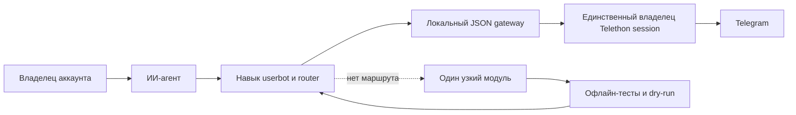

# Telegram Userbot Skill

<p align="center">
  <a href="README.md">English</a> ·
  <a href="README.ru.md"><strong>Русский</strong></a>
</p>

<p align="center">
  
</p>

<p align="center">
  <strong>Управление личным Telegram-аккаунтом через контролируемый и проверяемый интерфейс для ИИ-агента.</strong>
</p>

Этот репозиторий содержит независимый от конкретного агента навык **`userbot`** и чистый шаблон локального runtime на [Telethon](https://docs.telethon.dev/). С его помощью агент может читать данные Telegram, работать с сообщениями и медиа, управлять поддерживаемыми функциями аккаунта, получать события и добавлять узкую операцию, если её ещё нет в каталоге.

Это инструмент автоматизации пользовательского аккаунта, а не обёртка над Bot API. Он работает через Telegram-сессию, которую локально авторизует владелец аккаунта.

> [!CAUTION]
> **Внимание: этот навык полностью берёт на себя управление вашим Telegram-аккаунтом.**
>
> После авторизации Telethon-сессии подключённый агент потенциально получает доступ к личным перепискам и данным аккаунта. После вашего явного подтверждения защищённые модули также могут отправлять, редактировать, пересылать, закреплять и удалять сообщения; менять данные профиля; управлять группами и каналами; скачивать медиа и выполнять другие операции из установленного каталога.
>
> Используйте навык только на доверенном компьютере и с агентом, которому вы доверяете. Относитесь к файлу `.session` как к паролю: тот, кто получит рабочую сессию, сможет действовать от имени аккаунта. Никогда не отправляйте session, API hash, код входа, пароль 2FA, номер телефона, account env, выгрузки чатов или приватные медиа в чат с агентом, GitHub, облако или Docker-образ.

## Зачем нужен этот проект

Большинство инструментов автоматизации Telegram дают либо бота, либо неограниченный скрипт. Здесь между агентом и аккаунтом есть отдельный контролируемый слой:

- Естественный запрос сначала направляется в существующую проверенную операцию.
- Одна локальная программа владеет Telegram-сессией и не допускает конкурентный доступ к SQLite.
- Частые чтения идут через локальный Unix-socket gateway, который запускается по требованию и выключается после простоя.
- Операции записи по умолчанию работают в dry-run и требуют отдельный `--execute`.
- Цели пакетной операции фиксируются до выполнения, а результат проверяется повторным чтением.
- Недостающая возможность добавляется через ограниченный цикл разработки и тестирования одного модуля.
- Ключи, session, логи, медиа и данные чатов находятся вне публичного репозитория.

## Как это работает



Навык и рабочий Telegram runtime намеренно разделены:

| Уровень | Назначение | Есть секреты? |
|---|---|---:|
| Репозиторий навыка | Инструкции агенту, правила безопасности, валидаторы, шаблон исходников | Нет |
| Установленный навык | Локальная копия, которую обнаруживает Codex или другой агент | Нет |
| Userbot runtime | Telethon-код, профиль аккаунта, session, логи, база событий, скачанные медиа | Да — только локально |
| Telegram | Внешний аккаунт и его данные | Внешний сервис |

Операция, изменяющая Telegram, должна пройти такой путь:

```text
запрос → точная цель → dry-run preview → подтверждение владельца
       → --execute → повторное чтение состояния → проверенный результат
```

## Что умеет агент

Источником истины является registry установленного runtime. В текущем шаблоне есть защищённые маршруты для следующих задач:

- **Сообщения:** поиск по истории, последние сообщения, отправка, редактирование своего сообщения, пересылка точных message ID, pin и unpin.
- **Диалоги:** списки личных чатов, групп, каналов, ботов, участников, собственных каналов и каналов, где аккаунт оставлял комментарии.
- **Голосовые и медиа:** нативная расшифровка через Telegram, очередь media-aware саммари за день, preview и скачивание выбранных вложений в локальный runtime.
- **Аккаунт:** просмотр и изменение поддерживаемых полей профиля и custom-emoji status.
- **Группы и реакции:** просмотр и изменение прав одного участника, упоминания, реакции и удаление собственных сообщений через контролируемые batch-планы.
- **События и интеграции:** локальная SQLite-очередь личных сообщений, упоминаний и ответов; опциональные компактные webhook-события с HMAC-подписью.
- **Расширение:** проверка установленного Telethon API и добавление одного узкого протестированного модуля, если подходящего маршрута нет.

Это не универсальная консоль для произвольных Telegram-запросов. Аутентификация, восстановление и смена пароля, passkeys, смена номера, удаление аккаунта, платежи, подарки, Stars, возвраты, SMS-задачи и внутренности secret chats намеренно исключены из общего механизма расширения.

## Модель безопасности

- Первый вход выполняет владелец локально: он сам вводит Telegram-код и пароль 2FA.
- Агент никогда не просит, не читает, не вводит, не копирует, не загружает и не коммитит ключи или session.
- Direct helpers не запускают интерактивный login и используют только уже авторизованную сессию.
- Lock не даёт двум Telethon-клиентам одновременно открыть session одного аккаунта.
- Read-only gateway-вызовы могут выполняться сразу; Telegram write требует точного preview и явного подтверждения.
- Webhook — только канал уведомления, а не разрешение на запись в Telegram.
- В логах остаются ограниченные технические метаданные, а не ключи и полные приватные переписки.
- Docker не используется для обхода sandbox или запуска второго владельца Telegram-сессии.

Полные границы описаны в [SECURITY.md](SECURITY.md).

## Установка

Выберите язык:

- [Инструкция по установке на русском](INSTALL.ru.md)
- [Installation guide in English](INSTALL.md)

В гайде есть два сценария:

1. **Передать инструкцию coding agent.** Внутри находится готовое задание для копирования, обязательные точки остановки и проверки результата.
2. **Установить вручную.** Есть команды валидации, установки в Codex, создания runtime, локального входа владельца, smoke test и безопасного обновления.

Минимальная предварительная проверка после открытия репозитория:

```bash
git clone https://github.com/eugeneb1ack/telethon-userbot-operations-skill.git \
  "$HOME/telethon-userbot-skill"
cd "$HOME/telethon-userbot-skill"

python3 scripts/validate_package.py
python3 scripts/test_bootstrap_userbot_project.py
python3 scripts/test_session_checker.py
```

Эти проверки работают офлайн: они не подключаются к Telegram и не читают аккаунт.

## Примеры запросов

После установки и локальной авторизации session владельцем можно просить агента:

```text
Покажи три последних входящих личных сообщения.

Найди все упоминания меня в этой группе за сегодня и кратко объясни контекст.

Расшифруй сегодняшние голосовые в этом чате, поставь их в очередь и отдельно перечисли незавершённые.

Подготовь dry-run редактирования сообщения 42 в @example. Пока не выполняй.

Найди Telegram-каналы, где я оставлял комментарии, без вывода текста приватных сообщений.
```

Сначала агент обращается к локальному router и расширяет runtime только тогда, когда подходящего маршрута действительно нет.

## Структура репозитория

```text
telethon-userbot-operations-skill/
├── SKILL.md                         # основные инструкции агенту
├── README.md / README.ru.md         # описание проекта
├── INSTALL.md / INSTALL.ru.md       # гайды для пользователя и агента
├── SECURITY.md                      # границы ключей, session и write-операций
├── assets/                          # публичная графика README
├── references/                      # операции, session, webhook, разработка модулей
├── scripts/
│   ├── bootstrap_userbot_project.py # создаёт только НОВЫЙ runtime
│   ├── verify_userbot_session.py    # offline / явная online-проверка
│   ├── telethon_api_inventory.py    # introspection API без сети
│   └── validate_package.py          # проверка пакета и секретов
└── templates/userbot/               # чистый шаблон runtime
    ├── core/                         # config, lock, gateway, event store
    ├── modules/                      # защищённые Telegram-операции
    ├── scripts/                      # router, runner, daemon, account setup
    ├── tests/                        # офлайн-тесты с fake client
    └── docs/                         # контракт разработки модулей
```

## Проверка пакета

Ни одна команда ниже не подключается к Telegram:

```bash
python3 scripts/validate_package.py
python3 scripts/test_bootstrap_userbot_project.py
python3 scripts/test_interactive_account_setup.py
python3 scripts/test_session_checker.py
```

Для разработки runtime-модулей дополнительно используется gate созданного проекта:

```bash
venv/bin/python scripts/check_module.py modules/<module_name>.py --full
```

## Граница публичного репозитория

Сам репозиторий спроектирован как публичный, но рабочий runtime публичным быть не может. Перед каждым коммитом и релизом проверяйте, что в checkout нет `.env`, `accounts/`, `runtime/`, `.session`, SQLite-баз, архивов чатов, скачанных медиа, номеров телефонов, API credentials, webhook secrets, токенов и реальных Telegram document references.

Если ключ или session когда-либо попали в коммит, недостаточно удалить файл в следующей версии. Нужно отозвать или заменить скомпрометированный материал и очистить историю Git до публикации.

## Статус проекта и дисклеймер

Это независимый проект на базе Telethon. Он не связан с Telegram, не одобрен и не спонсируется Telegram. Название Telegram и связанные товарные знаки принадлежат их владельцам.

Используйте проект только с аккаунтами, которыми вы владеете или которыми вам явно разрешено управлять. Соблюдайте правила Telegram, местное законодательство и приватность людей, чьи сообщения доступны аккаунту.
